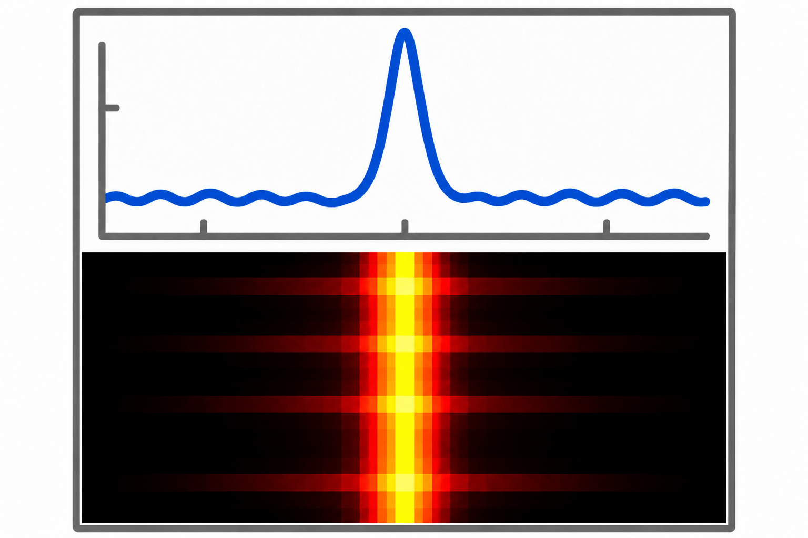
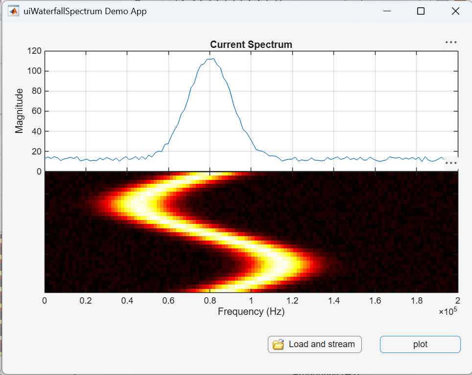
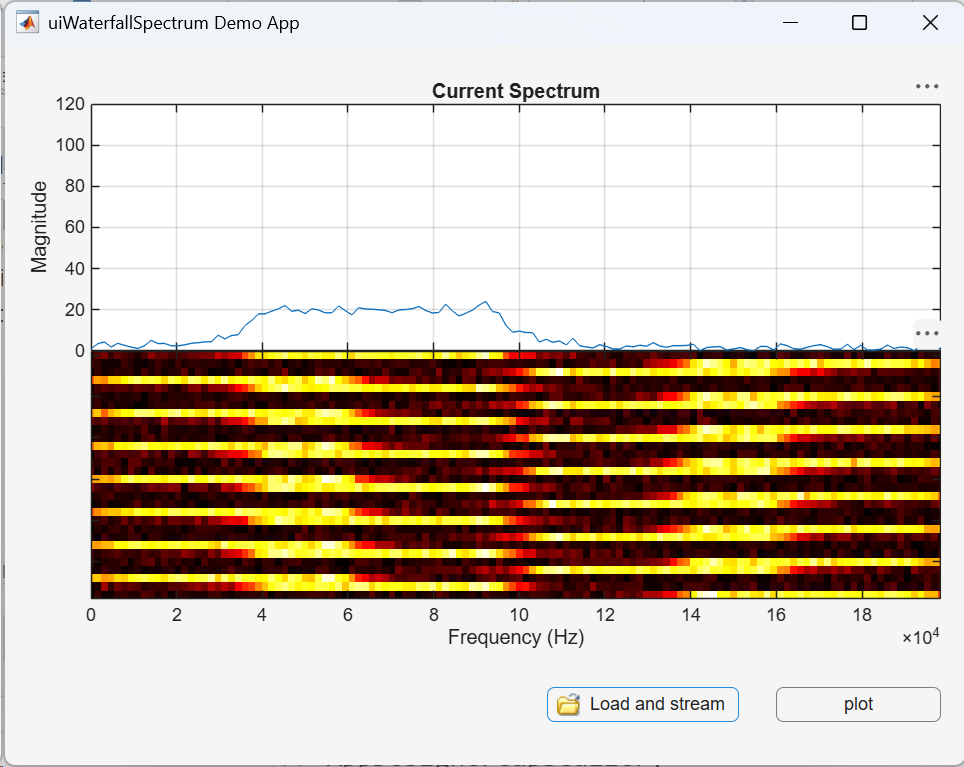

# UI Waterfall Spectrum
[](https://matlab.mathworks.com/open/github/v1?repo=mathworks/WaterfallSpectrum)
[](https://matlab.mathworks.com/open/fileexchange/v1?id=FILE_EXCHANGE_ID)




`uiWaterfallSpectrum` is a reusable MATLAB&reg; App Designer UI component for
displaying a current spectrum above a scrolling 2-D waterfall image.

RF engineers, signal-processing engineers, and vibration analysts can use the
display to monitor time-varying spectral content, spot transient RF events, and
track how vibration frequencies evolve.



The two axes share a compact vertical layout with no padding or spacing. The
upper axes displays the latest spectrum, while the lower image displays recent
spectra with the newest spectrum at the top.

## Features

- **App Designer integration**: Add the visualization as a reusable custom UI
  component.
- **Current spectrum display**: Show the latest spectrum as a line trace.
- **Scrolling history**: Append spectra to a 2-D intensity image while
  retaining a configurable number of frames.
- **Design-time properties**: Configure labels, titles, limits, history
  length, colormap, and colorbar visibility.
- **Programmatic updates**: Set a complete data history or stream one spectrum
  at a time from an app callback.
- **Standalone figure**: Display spectrum history outside App Designer with
  `WaterfallSpectrum`.
- **Axes access**: Customize the underlying axes through the read-only
  `RawAxes` and `ImageAxes` properties.
- **Example app**: Generate synthetic data or load and stream a CSV signal.

## Included Files

- `uiWaterfallSpectrum.mlapp` — reusable App Designer UI component.
- `uiWaterfallSpectrum_demo.mlapp` — example app showing synthetic plotting
  and CSV streaming.
- `WaterfallSpectrum.m` — standalone function for displaying the
  visualization in a MATLAB figure.
- `loadWaterfallSignalData.m` — imports and normalizes signal data from
  matrices, tables, timetables, and supported data files.
- `resources/appDesigner.json` — App Designer component-library metadata.
- `docs/images` — component icon and demo screenshots used by this README.
- `file_open.png` — icon used by the demo app.
- `signal_data.csv` — sample signal data.
- `LICENSE.txt` — software license.
- `SECURITY.md` — security vulnerability reporting guidance.

## Setup

1. Download and extract the submission. Keep `uiWaterfallSpectrum.mlapp` and
   the generated `resources` folder together in the submission root.
2. Add its root folder to the MATLAB path. For a manually downloaded copy:

   ```matlab
   addpath("path/to/uiWaterfallSpectrum_FileExchange")
   savepath
   ```

3. If App Designer is already open, close and reopen it before opening the
   demo so that its Component Library refreshes.
4. Open or create an app and locate `uiWaterfallSpectrum` under **My
   Components** in the Component Library.
5. Drag the component onto the App Designer canvas and configure it through
   the Component Browser or app code.

## Run the Demo

Open `uiWaterfallSpectrum_demo.mlapp` in App Designer and click **Run**, or
launch it from the MATLAB Command Window:

```matlab
uiWaterfallSpectrum_demo
```



The demo provides two buttons:

- **plot** generates and displays a synthetic 30-frame spectrum history.
- **Load and stream** imports a signal and streams it through an FFT of up to
  256 points.

The loader accepts:

- CSV, text, DAT, TSV, spreadsheet, and MAT files.
- Numeric vectors and matrices.
- Tables and timetables stored in MAT files.

For tables, the loader recognizes common time and signal variable names. If
none match, it selects the first suitable numeric variable. For numeric
matrices, rows are samples; a strictly increasing first column is interpreted
as time and the second column as the signal. Otherwise, the first column is
used as the signal.

When time data is available, the sample rate is inferred from it. Otherwise,
the frequency axis is shown in cycles per sample. The bundled
`signal_data.csv` is supported directly: `Time` supplies the sample times and
`Channel1` is selected as the signal.

## Use in a MATLAB Figure

Call `WaterfallSpectrum` without inputs to open a standard MATLAB figure with
synthetic spectrum data:

```matlab
WaterfallSpectrum
```

To display your own data, provide an `N`-by-`M` matrix with one spectrum per
column. The last column is shown as the current spectrum:

```matlab
frequency = linspace(0, 200e3, 128).';
history = rand(128, 30);

[fig, rawAxes, imageAxes] = WaterfallSpectrum( ...
    history, ...
    XData=frequency, ...
    Colormap="hot", ...
    ShowColorbar=true);
```

Use the returned figure and axes handles for additional customization.

## Add the Component to an App

After dragging the component into an App Designer app, App Designer creates a
component property such as:

```matlab
app.uiWaterfallSpectrum
```

You can also create the component programmatically:

```matlab
fig = uifigure(Name="Waterfall Spectrum");
fig.Position(3:4) = [600 450];

wf = uiWaterfallSpectrum(fig);
wf.Position = [20 20 560 410];
```

The examples below use `wf` for the component. In an App Designer callback,
assign it from the component property:

```matlab
function PlotButtonPushed(app, event)
    wf = app.uiWaterfallSpectrum;

    % Update wf here.
end
```

## Plot a Complete Data Set

For `N` frequency bins and `M` spectra, `WaterfallData` is an `N`-by-`M`
matrix with one spectrum per column:

```matlab
nBins = 128;
nFrames = 30;

frequency = linspace(0, 200e3, nBins).';
frame = 1:nFrames;
center = 80e3 + 35e3*sin(2*pi*frame/nFrames);

history = 10 + 100*exp(-((frequency-center)/15e3).^2);
history = history + 5*rand(nBins, nFrames);

wf.clearData();
wf.XData = frequency;
wf.WaterfallData = history;
wf.RawData = history(:, end);
wf.RawTitle = "Current Spectrum";
```

## Stream Spectra

Use `appendSpectrum` to update the upper trace and add one spectrum to the
waterfall history:

```matlab
frequency = (0:127).' * (400e3/256);

wf.clearData();
wf.XData = frequency;
wf.MaximumHistory = 30;

for frame = 1:100
    spectrum = abs(randn(128, 1));
    wf.appendSpectrum(spectrum);
    drawnow limitrate
end
```

You can also provide the horizontal coordinates with a spectrum:

```matlab
wf.appendSpectrum(spectrum, frequency);
```

## Public API

### Methods

| Method | Description |
| --- | --- |
| `appendSpectrum(spectrum)` | Displays and appends one spectrum using the current `XData`. |
| `appendSpectrum(spectrum, xData)` | Sets `XData`, then displays and appends one spectrum. |
| `clearData()` | Clears the current trace, waterfall history, and horizontal coordinates. |

### Properties

| Property | Description | Default |
| --- | --- | --- |
| `RawData` | Current `N`-element spectrum displayed in the upper axes. | Empty |
| `WaterfallData` | `N`-by-`M` history with one spectrum per column. | Empty |
| `XData` | `N` horizontal coordinates, typically frequency values. | Bin numbers |
| `MaximumHistory` | Maximum spectra retained by `appendSpectrum`. | `30` |
| `Colormap` | `"hot"`, `"jet"`, `"gray"`, `"bone"`, or `"summer"`. | `"hot"` |
| `RawYLimits` | Upper axes limits, or `[NaN NaN]` for automatic limits. | `[0 120]` |
| `ColorLimits` | Waterfall color limits, or `[NaN NaN]` for automatic limits. | `[NaN NaN]` |
| `RawYLabel` | Upper axes y-axis label. | `"Magnitude"` |
| `XLabel` | Lower axes x-axis label. | `"Frequency (Hz)"` |
| `RawTitle` | Upper axes title. | `""` |
| `ImageTitle` | Lower axes title. | `""` |
| `ShowColorbar` | Shows or hides the waterfall colorbar. | `false` |

The read-only `RawAxes` and `ImageAxes` properties provide access to the
underlying axes for additional customization.

## MathWorks Products

Requires MATLAB with App Designer. No additional MathWorks&reg; toolboxes are
required.

The component and demo were developed and tested with MATLAB R2026a. Earlier
releases have not been tested.

### System Requirements

[Operating system requirements](https://www.mathworks.com/support/requirements/previous-releases.html)

## License

The license is available in [LICENSE.txt](LICENSE.txt).

## Security

See [SECURITY.md](SECURITY.md) for instructions on reporting security
vulnerabilities.
